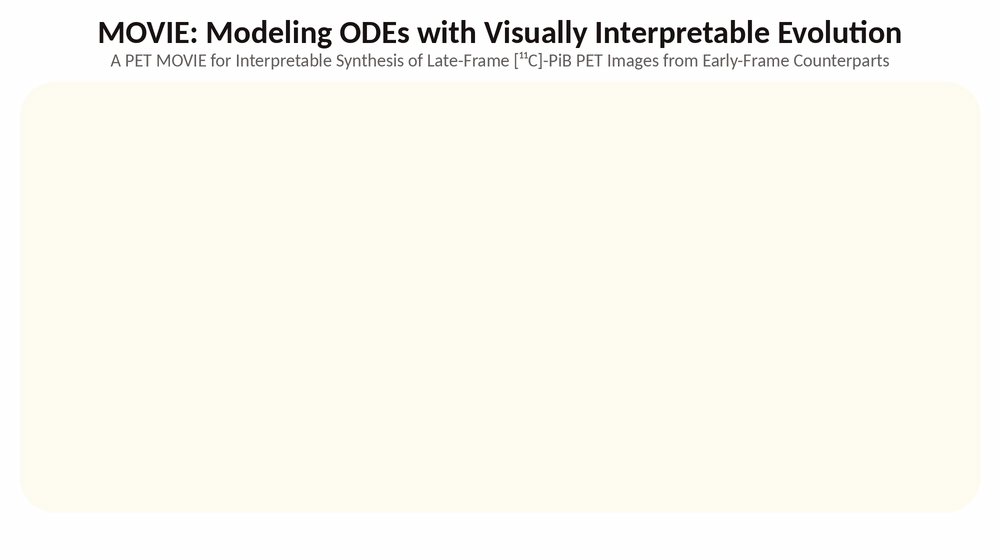

# MOVIE: Interpretable Synthesis of Late-Frame [¹¹C]-PiB PET from Early-Frame Counterparts

Official implementation of the paper:

> **A PET MOVIE for Interpretable Synthesis of Late-Frame [¹¹C]-PiB PET Images from Early-Frame Counterparts**  
> *EJNMMI Physics, 2026 (in press)*



---

## Overview

MOVIE (Modeling ODEs with Visually Interpretable Evolution) synthesizes late-frame [¹¹C]-PiB PET images directly from early-frame acquisitions, reducing patient scan time while maintaining diagnostic quality. The model uses a **LKMUNet** backbone (Mamba-based U-Net) combined with either a **Stochastic Differential Equation (SDE)** or **Ordinary Differential Equation (ODE)** module conditioned via **FiLM** (Feature-wise Linear Modulation) on intermediate PET frames.

---

## Scope of this repository

This repository contains the MOVIE model, training and image-level evaluation (PSNR, SSIM,
LPIPS, MSE). It does not include: PET preprocessing (SPM12), slice extraction and
normalization statistics, the UNet baseline, SUVR/Centiloid ROI analysis, outlier quality
control, statistical tests (Shapiro-Wilk, Wilcoxon, FDR), Bland-Altman, Glass's Δ, ROC/DCA
analyses, the early-frame timing sensitivity analysis, or the trajectory visualization.
These analyses are described in detail in the paper (link will be added upon publication).
<!-- TODO: replace the sentence above with the DOI link, e.g.
These analyses are described in detail in the [paper](https://doi.org/10.xxxx/xxxxx). -->

Image metrics are computed per 2D slice on min-max-normalized images (`data_range = 1`),
averaged per subject, and reported as mean ± SD across subjects.

---

## Project Structure

```
MOVIE/
├── configs/                              # Example config files with fictitious data (see Data)
├── datasets/
│   └── early2late_dataset.py             # Dataset class
├── models/
│   ├── lkmunet.py                        # LKMUNet backbone (adapted from LKM-UNet, Apache-2.0)
│   ├── sde_film.py                       # SDE-FiLM model
│   └── ode_film.py                       # ODE-FiLM model
├── figures/                              # Figures used in this README
├── train.py                              # Training script
├── inference.py                          # Inference & evaluation script
├── requirements.txt
├── LICENSE                               # MIT
└── LICENSE-APACHE                        # Apache 2.0 (for models/lkmunet.py)
```

---

## Requirements

### Environment

The code has been tested with PyTorch 2.6.

```bash
conda create -n movie python=3.10
conda activate movie
```

### Install dependencies

> **Note:** `mamba-ssm` requires CUDA. Install the CUDA build of PyTorch from the official
> PyTorch index first, then the remaining packages. See https://pytorch.org/get-started/locally/

```bash
pip install torch==2.6.0 torchvision==0.21.0 --index-url https://download.pytorch.org/whl/cu118
pip install -r requirements.txt
```

`requirements.txt` pins `torch==2.6.0`, which is satisfied by the CUDA build installed above
(e.g. `2.6.0+cu118`). Use the index URL that matches your CUDA version.

**Note:** `mamba-ssm` can be tricky to install. If you encounter issues:
```bash
pip install mamba-ssm --no-build-isolation
```

---

## Data

The [¹¹C]-PiB PET data used in the paper were acquired at National Taiwan University Hospital
(NTUH) as part of a previously conducted amyloid PET imaging study, and were retrospectively
analyzed with approval from the NTUH Institutional Review Board. The data cannot be shared
publicly because of patient privacy. The data are available from the corresponding author
upon reasonable request.

### Preprocessed data

Pass the dataset folder to `--data-root`. The expected structure is:

```
Preprocessed_Early2Late_withLatent/
├── group0/
│   ├── data/              # Early frame (frame 13), one .npy per slice
│   ├── ground_truth/      # Late frame (frame 24), one .npy per slice
│   └── latent_target/     # Mid frames (frames 17, 19, 21), one .npy per slice
├── group1/
│   └── ...
└── group4/
    └── ...
```

- File naming: `{SubjectID}_{sliceIndex}.npy`, e.g. `Subject001_042.npy`. The same file name is
  used in `data/`, `ground_truth/` and `latent_target/`.
- `data/` and `ground_truth/`: 2D float arrays of shape `H × W` (raw intensities).
- `latent_target/`: float array of shape `H × W × M` with the `M = 3` mid frames along the last axis.
- Slices are resized to 128 × 128 when loaded.
- `groupK` must match the group keys in `configs/stratified_5fold_all.json`.
- `latent_target/` is only needed for training and validation; the test split (inference) reads
  the early and late frames only.

### Configuration files

The code reads three files from `configs/`. The real files are not distributed. This repository
provides example files with fictitious data for three subjects (`Subject001`–`Subject003`):

- `configs/stratified_5fold_all.example.json`
- `configs/subjects_data_with_abeta.example.json`
- `configs/subject_stats_Early2Late_withLatent_FULL_0729.example.csv`

To run the code, place your own files in `configs/` in the same format, using the file names
without `.example` (e.g. `configs/stratified_5fold_all.json`). These file names are listed in
`.gitignore`, so they are not committed by accident.

**`configs/stratified_5fold_all.json`** — subject split for 5-fold cross-validation.

| Key | Type | Meaning |
|---|---|---|
| `"0"` … `"4"` | list of strings | Subject IDs (e.g. `"Subject001"`) in each group |

Subjects are assigned to five groups stratified by scanner vendor and diagnosis. For fold `f`,
group `(f + 2) mod 5` is the validation set, group `(f + 3) mod 5` is the test set, and the
remaining three groups are the training set (60/20/20).

**`configs/subjects_data_with_abeta.json`** — subject metadata, keyed by `"patientNNN"`
(corresponding to `SubjectNNN`).

| Field | Type | Meaning |
|---|---|---|
| `Diagnosis` | string | Clinical diagnosis label |
| `Instrument` | string | Scanner vendor |
| `Amyloid beta` | integer | Amyloid status: `1` positive, `0` negative, `-1` unknown |

These fields are returned with each sample but are not used for training or inference.

**`configs/subject_stats_Early2Late_withLatent_FULL_0729.csv`** — per-subject intensity
statistics used for min-max normalization.

| Column | Type | Meaning |
|---|---|---|
| `Type` | string | Frame type: `data` (early), `ground_truth` (late), `latent_target_frame1`–`latent_target_frame3` (mid) |
| `Subject` | string | Subject ID (e.g. `Subject001`) |
| `Max Value` | float | Maximum intensity of the subject's volume for this frame type |
| `Min Value` | float | Minimum intensity of the subject's volume for this frame type |

Only the `data` rows are used: all frames of a subject are normalized with the statistics of
that subject's early frame (see Implementation details).

---

## Training

Run all commands from the repository root (the scripts read `configs/` with relative paths).

```bash
python train.py \
  --model sde \
  --data-root /path/to/Preprocessed_Early2Late_withLatent \
  --save-dir ./runs \
  --epochs 150 \
  --seeds 42 2025 31415 1105 806 \
  --folds 0 1 2 3 4
```

**Key arguments:**

| Argument | Default | Description |
|---|---|---|
| `--model` | `sde` | Model variant: `sde` or `ode` |
| `--data-root` | required | Path to the preprocessed dataset |
| `--save-dir` | `./runs` | Parent directory for training outputs |
| `--epochs` | `150` | Number of training epochs |
| `--seeds` | `42` | Random seed(s); each seed trains all requested folds. The paper used seeds 42, 2025, 31415, 1105, and 806 |
| `--folds` | `0 1 2 3 4` | Fold(s) to train |
| `--lr` | `1e-4` | Learning rate (AdamW, weight decay 3e-2) |
| `--batch-size` | `16` | Batch size (gradient accumulation over 4 steps) |
| `--strategy` | `stack` | How mid frames are encoded: `stack` (encode each frame, then average), `concat` (concatenate along channels), or `auto` |
| `--baseline-csv` | *(optional)* | CSV with columns `Fold`, `mean_psnr`, `mean_ssim`, `mean_lpips`. If given, a checkpoint is saved only when it beats the baseline on all three metrics. It does not stop training early |

**Outputs:**

```
{save-dir}/runs_seed_LKMUNet_{SDE|ODE}{seed:05d}/
└── LKMU{SDE|ODE}_F{fold}_{timestamp}/
    ├── fold_{fold}/ckpt/
    │   ├── fold{f}_epoch{e}_psnr…_ssim…_lpips….pth
    │   ├── best.json  /  best.pth        # best checkpoint on the validation set
    │   └── last.json  /  last.pth        # final-epoch checkpoint
    ├── Loss/                             # loss curves
    └── Metric/                           # PSNR / SSIM / LPIPS / MSE curves
```

`best.json` records the checkpoint file name, epoch, validation metrics and selection criterion.
`best.pth` is a symbolic link to the same file, relative to the `ckpt/` folder.

---

## Inference

```bash
python inference.py \
  --model sde \
  --ckpt-dirs \
    ./runs/runs_seed_LKMUNet_SDE00042/LKMUSDE_F0_<timestamp> \
    ./runs/runs_seed_LKMUNet_SDE00042/LKMUSDE_F1_<timestamp> \
    ./runs/runs_seed_LKMUNet_SDE00042/LKMUSDE_F2_<timestamp> \
    ./runs/runs_seed_LKMUNet_SDE00042/LKMUSDE_F3_<timestamp> \
    ./runs/runs_seed_LKMUNet_SDE00042/LKMUSDE_F4_<timestamp> \
  --data-root /path/to/Preprocessed_Early2Late_withLatent \
  --output-prefix results_sde
```

Inference uses the early frame only. For each fold, the checkpoint listed in `best.json` is
loaded (or the target of `best.pth`); if neither exists, the script stops with an error.

**Key arguments:**

| Argument | Default | Description |
|---|---|---|
| `--model` | `ode` | Model variant: `sde` or `ode`. Note that the default differs from `train.py` (`sde`); always pass `--model` explicitly |
| `--ckpt-dirs` | required | The five `LKMU{SDE|ODE}_F{fold}_{timestamp}` run directories, in order F0–F4 |
| `--data-root` | required | Path to the preprocessed dataset |
| `--output-prefix` | `inference` | Output CSV filename prefix |

**Outputs:**
- `{prefix}_subject_metrics.csv` — per-subject mean ± std of PSNR / SSIM / LPIPS / MSE over slices
- `{prefix}_overall_metrics.csv` — mean ± std across subjects

---

## Model Architecture

### LKMUNet
A residual U-Net where each encoder stage is augmented with bidirectional Mamba layers (`BiPixelMambaLayer` + `BiWindowMambaLayer`) for efficient long-range dependency modeling.

### SDE-FiLM / ODE-FiLM
The bottleneck feature map is evolved through a stochastic (or deterministic) differential equation. FiLM conditioning injects information from intermediate PET frames into the drift field, enabling interpretable continuous-time synthesis. Mid frames are used only during training: guide-dropout phases them out from 30% to 100% of batches over the first 40 epochs, so inference requires the early frame only.

### Loss Function
```
L = MSE + (1 - SSIM)/2 + LPIPS + λ_sm · ∫||f(z)||² dt + λ_cons · (1 - cos_sim(early, mid))
```

with λ_sm = 5e-4 and λ_cons = 1.

---

## Implementation details

The following details of the implementation are not described in the paper:

- Linear learning-rate warm-up over the first 2,000 optimizer steps.
- Gradient clipping (max norm 1.0).
- Checkpoint selection on the validation set (PSNR + 25·SSIM, or LPIPS).
- All frames of a subject are min-max normalized with the statistics of that subject's early frame.
- Only the deepest encoder feature map is evolved by the ODE/SDE; the remaining U-Net skip
  connections pass early-frame features directly to the decoder.
- The drift network takes only the latent state as input, i.e. the dynamics are autonomous
  (dz/dt = f_θ(z)); the general form f_θ(z(t), t) in the paper includes this case.

---

## License

This project is released under the MIT License (see [LICENSE](LICENSE)).

`models/lkmunet.py` is adapted from [LKM-UNet](https://github.com/wjh892521292/LKM-UNet), which
builds on [nnU-Net](https://github.com/MIC-DKFZ/nnUNet),
[dynamic-network-architectures](https://github.com/MIC-DKFZ/dynamic-network-architectures) and
[U-Mamba](https://github.com/bowang-lab/U-Mamba). The original code is licensed under the
Apache License 2.0; a copy is provided in [LICENSE-APACHE](LICENSE-APACHE), and the copyright
notice is kept in the header of `models/lkmunet.py`.

---

## Citation

If you use this code, please cite our paper:

```bibtex
@article{tsai2026movie,
  title   = {A PET MOVIE for Interpretable Synthesis of Late-Frame [11C]-PiB PET Images from Early-Frame Counterparts},
  author  = {Tsai, Bo-Wei and Lin, Yu-Nong and Lin, Hsin-Ta and Li, Yi-Shih and Huang, Guan-Lin and
             Liu, Chia-Ju and Ko, Chi-Lun and Yen, Ruoh-Fang and Tsai, Hsin-Hsi and Chen, Kevin T.},
  journal = {EJNMMI Physics},
  year    = {2026}
}
```

---

## Contact

For questions, please open a GitHub issue.
